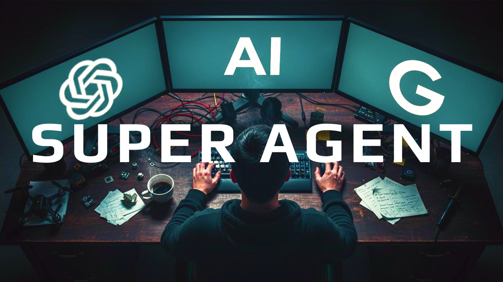
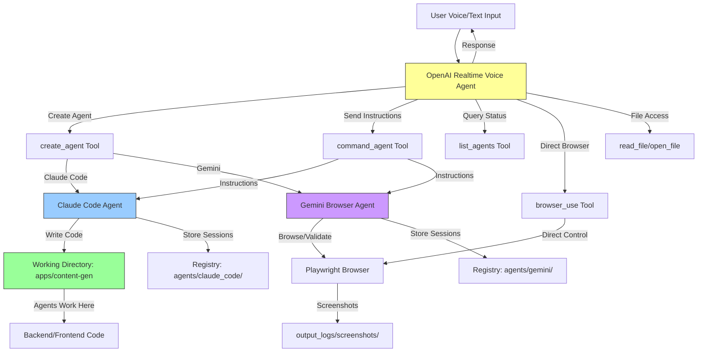

# Big Three Realtime Agents
> Voice agent (OpenAI Realtime API) that orchestrates coding agents (Claude Code) and browser agents (Gemini Computer Use)
> 
> **See this codebase in action [here](https://youtu.be/Ur3TJm0BckQ)**
> 



A unified voice-controlled orchestrator that coordinates three types of AI agents:
1. **OpenAI Realtime Voice Agent** - Natural voice interactions and orchestration
2. **Claude Code Agentic Coder** - Software development and file operations
3. **Gemini Browser Agent** - Web automation and validation

## Requirements

- **Python 3.11+**
- **[Astral uv](https://docs.astral.sh/uv/)** - Fast Python package installer and runner
- **API Keys**: OpenAI, Anthropic (Claude), Google (Gemini)
- **Playwright**: For browser automation (`playwright install` after setup)

Install `uv` if you don't have it:
```bash
curl -LsSf https://astral.sh/uv/install.sh | sh
```

## Setup

### 1. Clone and Navigate
```bash
cd apps/realtime-poc
```

### 2. Configure Environment
Copy `.env.sample` to `.env` and fill in required values:

```bash
# Required API Keys
OPENAI_API_KEY=sk-...           # For voice orchestration
ANTHROPIC_API_KEY=sk-ant-...    # For Claude Code agents
GEMINI_API_KEY=...              # For browser automation

# Optional API Keys (for future extensibility)
GROQ_API_KEY=
DEEPSEEK_API_KEY=
ELEVENLABS_API_KEY=             # For advanced TTS

# Configuration
ENGINEER_NAME=Dan               # Your name (for agent interactions)
AGENT_WORKING_DIRECTORY=        # Leave empty to use default (apps/content-gen)
```

### 3. Install Playwright
```bash
playwright install
```

### 4. Run
```bash
# Voice mode (recommended for full experience)
uv run big_three_realtime_agents.py --voice

# Text mode (for testing)
uv run big_three_realtime_agents.py --input text --output text

# Auto-dispatch with prompt
uv run big_three_realtime_agents.py --prompt "Create a new claude code agent, and have it list all the files in the working directory"

# Use mini model (faster/cheaper)
uv run big_three_realtime_agents.py --mini --voice
```

## Architecture



## Key Directories & Files

### Project Structure
```
big-3-super-agent/
├── .env.sample                 # Environment template
├── apps/
│   ├── content-gen/           # Agent working directory (default - you can change this to any directory you want)
│   │   ├── agents/            # Agent session registries
│   │   │   ├── claude_code/   # Claude Code agent sessions
│   │   │   └── gemini/        # Gemini agent sessions
│   │   ├── backend/           # Backend code (agents work here)
│   │   ├── frontend/          # Frontend code (agents work here)
│   │   ├── specs/             # Project specifications
│   │   └── logs/              # Agent execution logs
│   └── realtime-poc/          # Main orchestrator
│       ├── big_three_realtime_agents.py  # Main entry point
│       ├── prompts/           # System prompts for agents
│       │   └── super_agent/   # Orchestrator prompts
│       └── output_logs/       # Voice agent logs & screenshots
```

### Important Files

- **`big_three_realtime_agents.py`**: Main orchestrator script (3000+ lines)
  - Line 184-616: `GeminiBrowserAgent` class
  - Line 617-1540: `ClaudeCodeAgenticCoder` class
  - Line 1541-2900: `OpenAIRealtimeVoiceAgent` class

- **Working Directory**: `apps/content-gen/` (configurable via `AGENT_WORKING_DIRECTORY`)
  - All Claude Code agents operate with this as their `cwd`
  - Agents create/modify files relative to this directory
  - Registries stored in `agents/` subdirectory

## How It Works

### 1. Voice Orchestration
The OpenAI Realtime Voice Agent acts as the main orchestrator:
- Listens to user voice/text input
- Decides which agent type to use
- Dispatches tasks via tool calls
- Manages agent lifecycle (create, resume, list, delete)

### 2. Agent Working Directory
Agents are pointed to a specific working directory:
```python
AGENT_WORKING_DIRECTORY = Path(__file__).parent.parent / "content-gen"
```

- **Claude Code agents**: Work in this directory with full file access
- **Gemini agents**: Store browser session data here
- **Registries**: Each agent type has a registry file tracking active sessions

### 3. Tool-Based Dispatch
The orchestrator exposes these tools to the voice agent:
- `list_agents()` - Query all active agents and their status
- `create_agent(tool, type, agent_name)` - Create a new agent (Claude Code or Gemini)
- `command_agent(agent_name, prompt)` - Send instructions to an existing agent
- `delete_agent(agent_name)` - Remove an agent session
- `check_agent_result(agent_name, operator_file_name)` - Check agent execution results
- `browser_use(task, url)` - Direct browser automation task
- `open_file(file_path)` - Open a file in the default application
- `read_file(file_path)` - Read file contents
- `report_costs()` - Get API usage and cost information

### 4. Session Management
- Each agent gets a unique session ID
- Sessions stored in registry JSON files
- Sessions can be resumed across voice interactions
- Operator files created for each coding task

## Multi Agent Observability

This project includes built-in observability for tracking all agent activities in real-time. The system uses [Claude Code Hooks Multi-Agent Observability](https://github.com/disler/claude-code-hooks-multi-agent-observability) to stream events from all agents to a centralized dashboard.

### How It Works

**Zero setup required** - just turn it on and agents automatically ping out events:

1. **Claude Code Hooks** (`.claude/settings.json`): Automatically triggered on tool use, notifications, session stops, etc.
2. **Send Event Hook** (`.claude/hooks/send_event.py`): Forwards hook events to the observability server with AI-generated summaries
3. **OpenAI Agent Integration**: The `_send_observability_event` tool in `big_three_realtime_agents.py` sends custom events from the voice orchestrator

### What You See

- **Real-time event stream**: Every tool call, agent creation, file operation, and browser action
- **AI-generated summaries**: Automatic context-aware descriptions of what's happening
- **Session tracking**: Follow multiple agent sessions across the entire lifecycle
- **Cost monitoring**: Track API usage via the `report_costs()` tool
- **Chat transcripts**: Full conversation history included on session stops

### Quick Start

1. Clone and run the observability server:
   ```bash
   git clone https://github.com/disler/claude-code-hooks-multi-agent-observability
   cd claude-code-hooks-multi-agent-observability
   npm install && npm run dev
   ```

2. Start the agents (observability is already configured):
   ```bash
   uv run big_three_realtime_agents.py --voice
   ```

3. Open the dashboard at `http://localhost:3000`

Events automatically flow from:
- Claude Code agent tool calls (PreToolUse, PostToolUse)
- Voice orchestrator decisions
- Gemini browser actions
- Session lifecycle events

No configuration needed - it just works!

## Built With

This project is powered by cutting-edge AI technologies:

- **[Gemini 2.5 Computer Use](https://blog.google/technology/google-deepmind/gemini-computer-use-model/)** - Browser automation with vision and action planning
- **[OpenAI Realtime API](https://platform.openai.com/docs/guides/realtime)** - Natural voice interactions and orchestration
- **[OpenAI Sora API](https://platform.openai.com/docs/guides/video-generation)** - Video generation capabilities
- **[Claude Code](https://claude.com/product/claude-code)** - Agentic software development
- **[Astral uv](https://docs.astral.sh/uv/)** - Fast Python package management and script execution
- **[Tactical Agentic Coding](https://agenticengineer.com/tactical-agentic-coding)** - Agentic coding patterns and best practices

## Improvements

- **Break up large single agent**: `apps/realtime-poc/big_three_realtime_agents.py` is over 3000 lines of code, and although it's organized, it's still difficult to understand and maintain.
- **Error handling**: Add better recovery from API failures
- **Session persistence**: Store voice conversation history
- **Agent isolation**: Sandbox agent file operations more strictly
- **Cost tracking**: Monitor API usage per agent/session
- **Better logging**: Structured logging with trace IDs
- **Testing**: Add unit tests for each agent class
- **Configuration**: Move hardcoded values to config file
- **Agent interruption**: Enable agents to be interrupted and redirected by the voice agent
- **UI dashboard**: Web interface to monitor agent activities

## Future Directions

- **Multi-modal input**: Support image/video inputs for richer context
- **Agent templates**: Pre-configured agent profiles for common tasks
- **Tool extensions**: Plugin system for custom agent tools
- **Collaborative coding**: Multiple engineers working with same agents
- **Browser recording**: Record agent actions for debugging
- **Voice customization**: Train custom voice models
- **Mobile support**: iOS/Android companion apps
- **Cloud deployment**: Containerized deployment with Redis for state
- **Agent marketplace**: Share and discover agent configurations

## Troubleshooting

**"OPENAI_API_KEY not set"**: Ensure `.env` file exists and contains valid API key

**"playwright not found"**: Run `playwright install` after initial setup

**Agents not working in correct directory**: Check `AGENT_WORKING_DIRECTORY` in `.env`

**Voice not working**: Ensure microphone permissions granted and `pyaudio` installed

---

## Master AI **Agentic Coding**
> And prepare for the future of software engineering

Learn tactical agentic coding patterns with [Tactical Agentic Coding](https://agenticengineer.com/tactical-agentic-coding)

Follow the [IndyDevDan YouTube channel](https://www.youtube.com/@indydevdan) to improve your agentic coding advantage.

